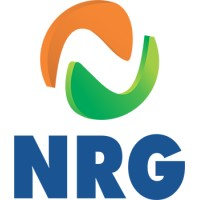
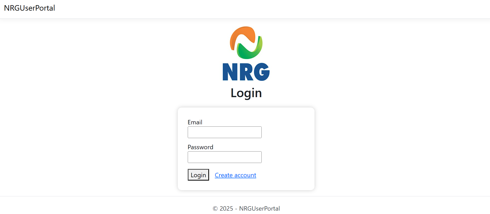
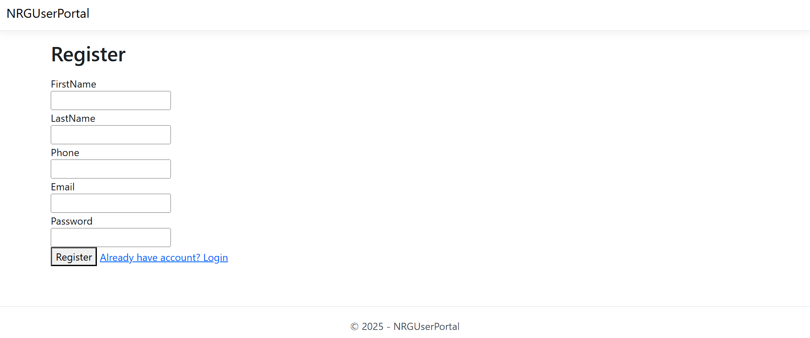
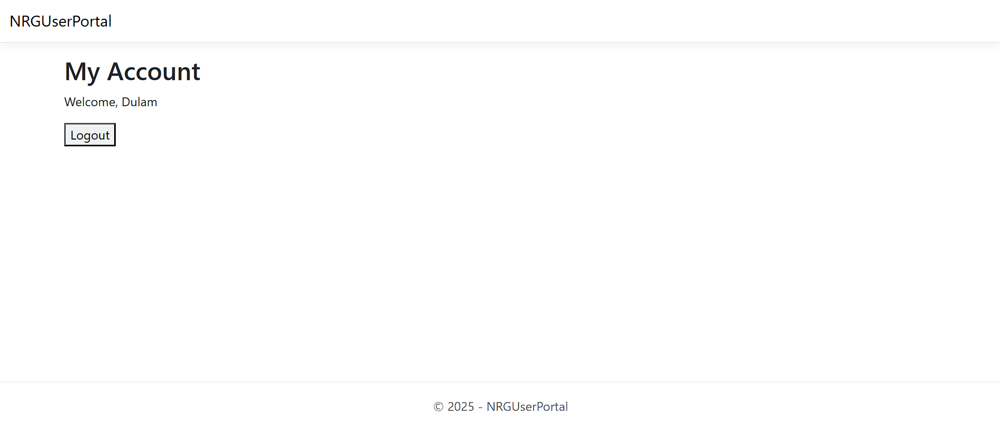

<p align="center">
  
</p>

<h1 align="center">NRG User Portal</h1>
<p align="center">🔐 A clean ASP.NET Core MVC application with Registration, Login, MyAccount, SQL Server & BCrypt hashing</p>

---

<p align="center">
  
  
  
  
  
</p>

---

## 📌 About the Project

This is a simple yet fully functional **User Authentication Portal** built without ASP.NET Identity — everything is coded manually for learning:

✔ Registration  
✔ Login  
✔ Password hashing using **BCrypt**  
✔ My Account (Welcome page)  
✔ Session handling  
✔ Logout  
✔ SQL Server database  

Made for learning **real-world ASP.NET MVC fundamentals**.

---

## 📂 Project Structure

```

NRGUserPortal/
│
├── Controllers/
├── Models/
├── Views/
│   ├── Account/
│   └── Shared/
│
├── wwwroot/
│   └── images/
│
├── Migrations/
├── screenshots/
│
├── Program.cs
├── appsettings.json
└── README.md

````

---

## 📸 Screenshots

### 🔹 Login Page  


### 🔹 Register Page  


### 🔹 My Account  


---

## 🚀 Features

### 🔐 Authentication
- Manual user creation  
- No ASP.NET Identity  
- Secure hashed passwords  

### 🧑‍💻 MVC Architecture
- Clean controller actions  
- Razor views  
- Strongly-typed models  

### 🗄 SQL Server + EF Core
- Code-first migrations  
- Users table  
- Database connection via appsettings.json  

---

## 🧩 Users Table Structure

| Column     | Type              |
|------------|-------------------|
| Id         | int (Primary Key) |
| FirstName  | nvarchar(100)     |
| LastName   | nvarchar(100)     |
| Phone      | nvarchar(20)      |
| Email      | nvarchar(256)     |
| Password   | nvarchar(max)     |

---

## ⚙️ Setup Instructions

<details>
<summary><b>📥 1. Clone the repository</b></summary>

```bash
git clone https://github.com/SanthoshDulam/NRGUserPortal.git
````

</details>

---

<details>
<summary><b>🛠 2. Open in Visual Studio</b></summary>

Open:

```
NRGUserPortal.sln
```

</details>

---

<details>
<summary><b>🗄 3. Update SQL Server Connection</b></summary>

In **appsettings.json**:

```json
"ConnectionStrings": {
  "DefaultConnection": "Server=SANTHOSH\\SQLEXPRESS;Database=NRGUserPortalDb;Trusted_Connection=True;TrustServerCertificate=True"
}
```

</details>

---

<details>
<summary><b>📦 4. Apply Migrations</b></summary>

```powershell
Update-Database
```

</details>

---

<details>
<summary><b>▶ 5. Run the Project</b></summary>

Use **IIS Express** → It will open at the Login page.

</details>

---

## 🔮 Future Enhancements

* OTP verification
* Forgot password
* Profile editing
* Modern UI redesign
* Role-based authentication

---

## 👤 Author

**Dulam Santhosh Satya Sai Naga Hanuman**
Fresher • Aspiring .NET Developer

---

## 🎯 Final Note

This project strengthened my understanding of MVC, authentication, EF Core, SQL Server, and secure password management.


